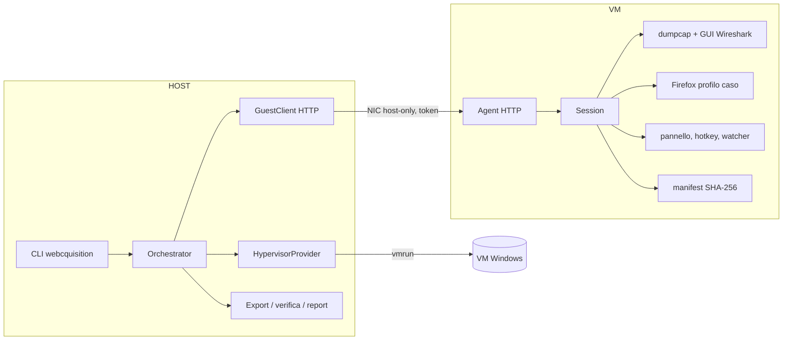
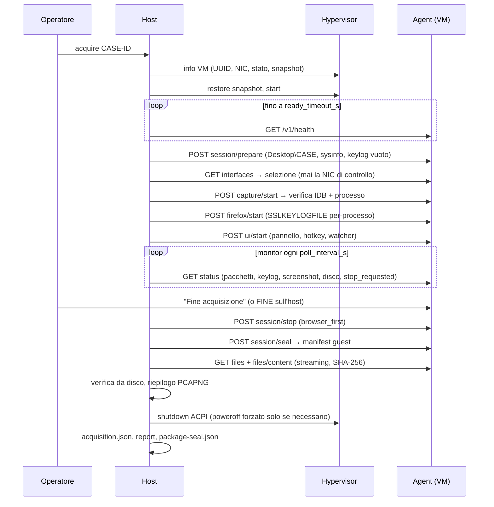

# Architettura e progettazione di WEBCQUISITION

Questo documento raccoglie la fase di progettazione richiesta dalle specifiche. Il codice è stato
generato direttamente, come indicato dall'istruzione finale delle specifiche; le scelte che
**deviano** dalle specifiche sono evidenziate in §22.

Legenda usata in tutta la documentazione:

- **Implementato**: presente nel codice.
- **Verificato automaticamente**: il software controlla e registra l'esito.
- **Da verificare dall'operatore**: il software non può saperlo con certezza.
- **Dipendente da hypervisor/OS**: comportamento che varia con la piattaforma.

---

## 1. Obiettivo e ambito

Rendere l'acquisizione di attività web **ripetibile** (stesso punto di partenza, stessa procedura),
**documentata** (ogni passo registrato con timestamp UTC) e **verificabile** (hash di ogni file,
log a prova di manomissione, report). Questa versione copre: VM Windows su VMware Workstation Pro, browser Firefox,
cattura con dumpcap/Wireshark, segreti TLS via `SSLKEYLOGFILE`.

Fuori ambito nell'MVP: acquisizione di app non-browser, mobile, dispositivi fisici, firma
qualificata/marca temporale del pacchetto (vedi ROADMAP), decifratura automatica del traffico.

## 2. Requisiti (sintesi)

Funzionali: avvio VM e attesa di prontezza; cartella `Desktop\<caso>`; key log TLS; cattura con
GUI visibile e verifica programmatica; Firefox con profilo dedicato; screenshot manuali; comando
"Fine acquisizione"; arresto cattura, chiusura Firefox, spegnimento controllato; export verso
l'host; pacchetto strutturato con report e metadati.

Non funzionali: log con timestamp, eventi JSONL, manifest SHA-256 con verifica post-trasferimento,
`acquisition.json`, separazione tra dati originali/metadati/log/file operatore/file automatici/
report, stati `INCOMPLETE`/`FAILED`, astrazione hypervisor, CLI, configurazione YAML senza valori
cablati, gestione esplicita degli errori, protezione da sovrascrittura e da VM/rete errate, test
con mock e `--dry-run`, documentazione completa.

## 3. Principi forensi adottati

1. **Mai sovrascrivere**: cartella caso host e guest devono non esistere; file creati in modalità
   esclusiva (`x`); download in `.partial` e rinomina solo dopo verifica dell'hash.
2. **Un caso, una acquisizione**: uno stato terminale non si riapre; l'agent accetta una sola
   sessione per avvio; la VM parte sempre dallo snapshot pulito.
3. **Il reperto è prodotto da strumenti noti e documentati** (dumpcap, Firefox) con comandi e
   versioni registrati; WEBCQUISITION orchestra e verifica, non altera i dati.
4. **Registrare, non nascondere**: ogni anomalia diventa un *issue* (WARNING/ERROR) in
   `acquisition.json`, nel log eventi e nel report; l'esito finale ne dipende.
5. **Separare** canale di controllo e rete di acquisizione (§9) e ruoli dei file (§19).
6. **Verificabilità a posteriori** senza WEBCQUISITION: `SHA256SUMS.txt` compatibile con
   `sha256sum -c`, JSON leggibile, catena di hash ricalcolabile con poche righe di codice.

## 4. Panoramica architetturale

Tre pacchetti Python nel repository (`src/`):

| Pacchetto | Dove gira | Dipendenze | Ruolo |
|---|---|---|---|
| `webcquisition` | host | PyYAML | CLI, orchestratore, provider hypervisor, export, report |
| `webcquisition_agent` | VM Windows | solo stdlib | API HTTP, cattura, Firefox, screenshot, pannello, sigillo |
| `webcquisition_common` | entrambi | solo stdlib | eventi, hashing, pcapng, percorsi sicuri, protocollo |



## 5. Componenti

**Host**: `config.py` (schema YAML tipizzato, chiavi sconosciute = errore), `case.py` (cartella
caso, lock, stato), `state.py` (transizioni ammesse), `providers/` (VMware, Fake), `vmware_setup.py` (preparazione automatica della VM), `bundle.py` (bundle
dell'agent), `guest_client.py` (HTTP), `fake_guest.py` (agent simulato con iniezione di guasti),
`orchestrator.py` (workflow), `manifest.py` (`acquisition.json`), `report.py` (HTML autocontenuto),
`cli.py`.

**Agent**: `settings.py`, `server.py`, `session.py`, `capture.py`, `ctrlc.py`, `firefox.py`,
`screenshot.py`, `hotkey.py`, `panel.py`, `watcher.py`, `sysinfo.py`, `interfaces.py`, `winutil.py`.

**Comune**: `events.py`, `hashing.py`, `pcapng.py`, `paths.py`, `protocol.py`, `timeutil.py`.

## 6. Struttura del repository

```
WEBCQUISITION/
├── src/webcquisition/            host
├── src/webcquisition_agent/      guest
├── src/webcquisition_common/     condiviso
├── tests/                        pytest (nessuna VM necessaria)
├── config/webcquisition.example.yaml
├── examples/                     agent.json, dry-run, script demo
├── scripts/                      build-agent-bundle.py, install-agent.ps1
├── docs/                         questa documentazione
├── .github/                      CI, template issue e PR
└── README.md LICENSE SECURITY.md CONTRIBUTING.md CHANGELOG.md pyproject.toml
```

## 7. Workflow



Dettaglio dei passi e degli eventi emessi: [EVENTS.md](EVENTS.md).

## 8. Macchina a stati

```
CREATED → PREPARING → ACQUIRING → FINALIZING → EXPORTING → VERIFYING → COMPLETED | INCOMPLETE | FAILED
              │                      ▲
              └──────────────────────┘  (errore dopo la preparazione del guest: si recupera il materiale)
PREPARING → FAILED                      (errore prima che il guest abbia prodotto dati)
```

- `COMPLETED`: export e verifica riusciti, almeno un PCAPNG valido con pacchetti, nessun errore.
- `INCOMPLETE`: pacchetto integro e verificato, ma con almeno un issue di livello ERROR (es. key
  log vuoto con `tls.required`, cattura interrotta durante la sessione, Firefox non partito).
- `FAILED`: nessuna cattura valida, export o verifica di integrità falliti, VM persa, oppure
  errore prima della preparazione del guest.

Lo stato è persistito in `metadata/case.json` con la storia delle transizioni; `session.json`
conserva lo stato di lavoro, così `start`/`status`/`stop` funzionano anche come processi separati.

## 9. Canale di controllo host ↔ guest

- **Scelta**: agent HTTP nella VM su una **NIC host-only dedicata** (NIC2), distinta dalla NIC di
  acquisizione (NIC1, tipicamente NAT). Il traffico di controllo non entra nel PCAPNG.
- Autenticazione con token Bearer (≥ 32 caratteri, confronto a tempo costante); header di versione
  del protocollo; l'agent rifiuta `listen_host=0.0.0.0` e la regola firewall ammette solo l'IP
  dell'host sull'IP host-only.
- **Alternative scartate** per l'acquisizione: guest operations di VMware Tools (`vmrun
  runProgramInGuest`): richiedono credenziali del guest sull'host a ogni caso e avviano processi
  fuori dalla sessione interattiva dell'operatore; cartelle condivise: espongono il filesystem
  host alla VM. Le guest operations sono usate **solo** dalla preparazione una tantum della VM
  (`vmware-setup`), con credenziali mai salvate.
- L'agent gira nella **sessione utente interattiva** (Scheduled Task "At logon"): Wireshark,
  Firefox e il pannello sono visibili all'operatore. `health.interactive_session` lo verifica.

## 10. VMware e preparazione della VM

`HypervisorProvider` (interfaccia) con due implementazioni: `VMwareProvider` (`vmrun`) e
`FakeProvider` (test e `--dry-run`). I comandi esterni passano da un `CommandRunner` iniettabile:
i test usano un simulatore di `vmrun` con stato. Dettagli: [VMWARE.md](VMWARE.md).

Controlli preliminari di ogni acquisizione (prima di avviare la VM): `.vmx` esistente, VM non
cifrata né sospesa né accesa, `uuid.bios` uguale a `vm_uuid`, schede uguali a `expected_nics`
(nessuna in più, tutte collegate all'accensione), snapshot presente una sola volta e ripristinato.

`vmware-setup` automatizza la messa in servizio: verifica e correzione delle schede nel `.vmx`,
individuazione della rete host-only, generazione dei segreti, installazione e configurazione nel
guest tramite VMware Tools (`guest-setup.ps1`), riavvio con verifica end-to-end dell'agent,
snapshot pulito, configurazione dell'host e rapporto di preparazione con catena di hash. Vedi
[VM-PREPARATION.md](VM-PREPARATION.md).

## 11. Preparazione del guest

`session/prepare`: validazione dell'ID caso (anche lato guest), risoluzione del Desktop reale
(`SHGetKnownFolderPath`, gestisce Desktop reindirizzati), creazione di `Desktop\<caso>` con
sottocartelle, `README.txt`, `metadata/sysinfo.json` (versioni Windows/Firefox/Wireshark, fuso
orario, stato `w32tm`, eventuale `SSLKEYLOGFILE` globale), key log vuoto pre-creato.

Orologio: l'host misura l'offset guest−host a inizio e fine (punto medio del round-trip); oltre
`max_clock_offset_s` si registra un WARNING.

## 12. Cattura di rete

dumpcap (o tshark) produce il reperto in `network/` con rotazione solo per dimensione (nessun file
viene eliminato). In modalità `dual` si avvia anche la GUI di Wireshark come vista dell'operatore.
Verifica: processo vivo, PCAPNG presenti, `if_name` degli IDB uguale all'interfaccia scelta
(`CAPTURE_STARTED`), poi crescita del contatore pacchetti (`CAPTURE_TRAFFIC_VERIFIED`). Arresto con
CTRL+C inviato alla console di dumpcap (chiusura corretta del file), fallback forzato registrato.
Dettagli: [CAPTURE.md](CAPTURE.md).

## 13. Segreti TLS

`SSLKEYLOGFILE` impostata **solo** nell'ambiente del processo Firefox avviato dall'agent e puntata a
`tls/sslkeylog.log` del caso. Segnalata come WARNING una variabile globale preesistente. Key log
vuoto a fine sessione: ERROR se `tls.required`. Limiti: [TLS-KEYLOG.md](TLS-KEYLOG.md).

## 14. Browser

Firefox con `-profile <caso>/browser/firefox-profile -no-remote -new-instance -wait-for-browser`;
`user.js` disattiva telemetria, studi, aggiornamenti, prima esecuzione, salvataggio credenziali e,
per default, DoH, HTTP/3 ed ECH (per rendere il traffico analizzabile). Tutte le preferenze sono in
`metadata/firefox-prefs.json`. Firefox parte solo con la cattura già attiva.

## 15. Screenshot e file dell'operatore

- Utility integrata: hotkey (default `Ctrl+Alt+S`) e pulsante del pannello → PNG dell'intero
  desktop virtuale in `screenshots/screenshot-NNNN.png` + JSON con SHA-256, ora UTC e locale,
  titolo della finestra in primo piano. Il pannello si nasconde durante lo scatto.
- Strumenti nativi (Win+Shift+S, Strumento di cattura…): l'operatore salva nella cartella del caso;
  il watcher registra ogni nuovo file con hash alla prima rilevazione e ogni modifica successiva.

## 16. Chiusura

Ordine configurabile (`finalize.order`): **`browser_first`** (default) chiude Firefox con
`WM_CLOSE` (salvataggio del profilo), poi ferma la cattura: così anche il traffico di chiusura del
browser è nel PCAP. Poi GUI Wireshark, hotkey, pannello, scansione finale del watcher, sigillo.

## 17. Export e integrità

1. Sigillo nel guest: chiusura del log eventi guest, `metadata/guest-manifest.json` e
   `metadata/SHA256SUMS.txt` (hash, dimensione, mtime di ogni file); file resi in sola lettura.
2. Export via agent, **prima** dello spegnimento: solo i file del manifest, in streaming, hash
   calcolato durante il download, `.partial` → rinomina solo se hash e dimensione coincidono,
   fino a `export.retries` tentativi.
3. Seconda verifica indipendente rileggendo da disco; file inattesi = errore; hash del manifest
   guest confrontato con quello dichiarato al sigillo.
4. `hashes/SHA256SUMS.txt`, `hashes/manifest.json`, `hashes/package-seal.json` (hash di
   `acquisition.json`, report, SHA256SUMS e log eventi host). L'hash di `package-seal.json` e
   l'hash di testa del log eventi vanno riportati nel verbale.
5. `webcquisition verify` ripete tutti i controlli offline.

## 18. Log ed eventi

Due log JSONL (host e guest), un evento per riga, timestamp UTC al millisecondo, `seq`
progressivo, `prev_hash`/`hash` SHA-256 su JSON canonico, `fsync` a ogni evento. Un log alterato
non viene esteso (l'apertura fallisce). In più `logs/host.log` (log testuale di debug) e
`logs/dumpcap-stderr.log` nel guest. Vedi [EVENTS.md](EVENTS.md).

## 19. Metadati e pacchetto

Categorie dei file acquisiti: `original.network_capture`, `original.tls_secrets`,
`original.browser_profile`, `auto.screenshot`, `auto.screenshot_metadata`, `operator.file`,
`guest.metadata`, `guest.log`. `acquisition.json` riporta caso, operatore, inizio/fine, fusi
orari, host, hypervisor e VM, versioni (Windows, Firefox, Wireshark, WEBCQUISITION), interfaccia,
PCAP (riepilogo), key log, hash, stato, issue, configurazione e suo SHA-256. Vedi
[CASE-STRUCTURE.md](CASE-STRUCTURE.md).

## 20. Gestione degli errori

| Situazione | Rilevazione | Codice | Esito tipico |
|---|---|---|---|
| vmrun assente | `is_available` | `HYPERVISOR_UNAVAILABLE` | FAILED, VM non toccata |
| VM errata / UUID diverso | `get_info` | `VM_NOT_FOUND`, `VM_IDENTITY_MISMATCH` | FAILED prima dell'avvio |
| Rete non conforme | NIC vs `expected_nics` | `NETWORK_CONFIG_MISMATCH` | FAILED prima dell'avvio |
| Snapshot mancante | elenco snapshot | `SNAPSHOT_NOT_FOUND` | FAILED prima dell'avvio |
| VM non parte | provider | `VM_START_FAILED` | FAILED |
| VM non pronta | health entro timeout | `VM_NOT_READY` | FAILED, VM spenta |
| Agent diverso / VM non pulita | health | `AGENT_IDENTITY_MISMATCH`, `GUEST_NOT_CLEAN` | FAILED |
| Wireshark/dumpcap non parte | agent | `CAPTURE_START_FAILED` | FAILED, materiale recuperato |
| Interfaccia assente/ambigua/di controllo | selezione | `INTERFACE_*` | FAILED, materiale recuperato |
| Cattura non verificabile | IDB/processo | `CAPTURE_NOT_VERIFIED`, `CAPTURE_INTERFACE_MISMATCH` | FAILED |
| Nessun pacchetto | contatore | `CAPTURE_NO_TRAFFIC` | FAILED se PCAP vuoto |
| Cattura interrotta durante la sessione | monitor | `CAPTURE_PROCESS_DIED` | INCOMPLETE |
| Firefox non parte | agent | `FIREFOX_START_FAILED` | INCOMPLETE/FAILED, materiale recuperato |
| Key log non creato / vuoto | controllo finale | `TLS_KEYLOG_EMPTY` | INCOMPLETE (se `tls.required`) |
| Disco quasi pieno | `disk_free_bytes` | `DISK_SPACE_LOW` | WARNING |
| Connessione persa temporaneamente | monitor | `AGENT_UNREACHABLE` → `AGENT_RECONNECTED` | WARNING |
| VM bloccata (agent muto, VM running) | monitor | `AGENT_UNREACHABLE_PERSISTENT` | WARNING, poi decisione operatore |
| VM persa (crash) | monitor + provider | `VM_LOST` | FAILED, snapshot post-mortem |
| Interruzione utente (Ctrl+C) | host | `ACQUISITION_INTERRUPTED` | chiusura ordinata |
| Copia fallita | export | `EXPORT_FILE_FAILED` | FAILED |
| Hash non corrispondente | export/verifica | `EXPORT_HASH_MISMATCH`, `INTEGRITY_FAILED` | retry, poi FAILED |
| Spegnimento non riuscito | provider | `VM_FORCED_POWEROFF` | WARNING |

## 21. Sicurezza

Token segreto su file con ACL, agent in ascolto solo sulla NIC host-only, firewall ristretto,
percorsi validati (nessun `..`, assoluto, UNC, `:`), download solo di file del manifest, nessuna
esecuzione di comandi arbitrari tramite API, key log trattato come materiale sensibile. Minacce e
rischi residui: [THREAT-MODEL.md](THREAT-MODEL.md).

## 22. Test, validazione e decisioni

Test automatici: 170+ test pytest (unità, provider VMware su simulatore di `vmrun`, preparazione
automatica della VM, esecuzione di `guest-setup.ps1` con PowerShell 7 e cmdlet simulati, server HTTP
reale su loopback, workflow completo con guasti iniettati, CLI end-to-end); CI su Ubuntu e Windows,
Python 3.10–3.12. Il protocollo di validazione in laboratorio è in [TESTING.md](TESTING.md).

**Decisioni che deviano dalle specifiche** (motivate):

1. **Export prima dello spegnimento della VM** (le specifiche indicano shutdown poi export): il
   canale di export è l'agent, disponibile solo a VM accesa; montare il disco della VM spenta
   dipenderebbe dall'hypervisor e dal formato del disco. In caso di errore la VM viene conservata
   con uno snapshot post-acquisizione (`post_acquisition_snapshot: on_failure`).
2. **Chiusura di Firefox prima della cattura** (default `browser_first`, configurabile): altrimenti
   il traffico generato alla chiusura del browser andrebbe perso.
3. **Il reperto è il file di dumpcap, la GUI di Wireshark è una vista**: la GUI non offre un modo
   robusto per essere controllata e verificata da programma; dumpcap sì. Entrambi sono visibili
   all'operatore (processo e finestra), il reperto è uno solo.
4. **`SSLKEYLOGFILE` per-processo invece che globale**: una variabile globale farebbe scrivere
   segreti anche ad altri programmi e a sessioni fuori dal caso.
5. **Agent obbligatorio nella VM**: necessario per GUI visibili, verifiche e export; installato una
   volta da `vmware-setup` prima dello snapshot pulito, documentato da `BUNDLE-SHA256SUMS.txt` e
   dal rapporto di preparazione.
6. **Solo VMware Workstation Pro** (su richiesta): VirtualBox e Hyper-V sono stati rimossi;
   Workstation Player è escluso perché `vmrun` non vi gestisce gli snapshot.
7. **Agent con privilegi limitati**: Firefox e gli altri processi dell'acquisizione non girano
   elevati; Npcap deve consentire la cattura agli utenti standard (verificato dal setup).

## 23. Fine acquisizione dall'interno della VM e recupero (0.2.1)

- **Spegnimento di Windows**: un thread dell'agent possiede una finestra top-level nascosta, avvisata
  per prima (`SetProcessShutdownParameters(0x3FF)`). Su `WM_QUERYENDSESSION`, se c'è una sessione
  attiva e l'host si è fatto sentire negli ultimi 120 s, risponde FALSE con
  `ShutdownBlockReasonCreate` e imposta `stop_source = guest_shutdown`. L'host esegue la chiusura
  normale (Firefox, cattura, sigillo, export, verifica) e poi chiama `session/release`: la finestra
  viene distrutta e Windows completa lo spegnimento avviato dall'operatore. L'host attende fino a
  60 s lo spegnimento, poi usa l'arresto controllato.
- **Recupero**: se la VM risulta spenta o sospesa prima o durante la chiusura, l'host la riavvia
  **senza** ripristinare lo snapshot.
  - VM sospesa: la sessione in memoria è intatta e la chiusura è normale.
  - VM spenta: l'agent riparte senza sessione e `session/recover` riapre `Desktop\<CASO>` come
    sessione già chiusa, con log eventi separato (`logs/guest-events-recovery.jsonl`, nuova
    catena). Il sigillo ne include tutto il contenuto; se il sigillo esisteva già viene riusato.

  L'esito è `INCOMPLETE` (`VM_LOST` + `RECOVERED_AFTER_POWER_LOSS`).
